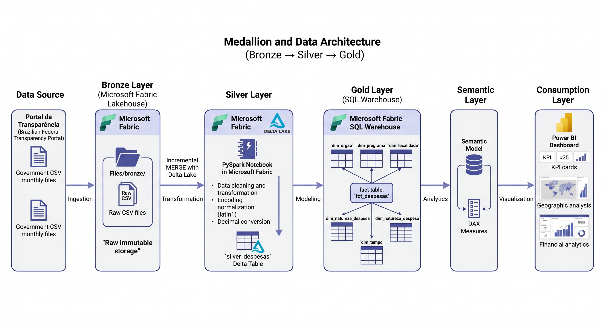
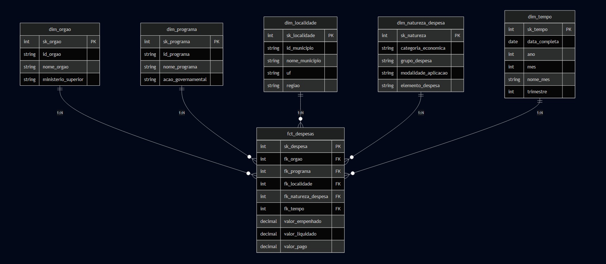
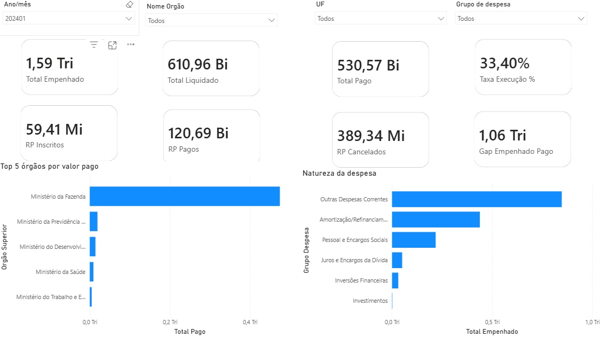

# Transparência Federal Analytics

Plataforma de analytics sobre execução orçamentária do governo federal brasileiro, desenvolvida no **Microsoft Fabric** com arquitetura Medallion (Bronze → Silver → Gold), modelagem Star Schema e integração com Power BI.

**Fonte:** Portal da Transparência — CGU &nbsp;|&nbsp; **Período:** 2024 &nbsp;|&nbsp; **Atualização:** mensal

---

## Arquitetura



O pipeline é dividido em três camadas:

| Camada | Notebook / Script | O que faz |
|--------|-------------------|-----------|
| Raw → Bronze | `Notebook_raw_to_bronze.ipynb` | Persistência dos arquivos brutos no Lakehouse |
| Bronze → Silver | `Notebook_bronze_to_silver.ipynb` | Padronização de schema, tratamento de tipos e carga incremental com Delta Lake |
| Silver → Gold | `sql/` (T-SQL no SQL Warehouse) | Modelagem dimensional Star Schema — dimensões e fato |

---

## Stack

| Camada | Tecnologia |
|--------|------------|
| Plataforma | Microsoft Fabric |
| Armazenamento | Lakehouse (OneLake) · Delta Lake |
| Processamento | PySpark (Fabric Notebooks) |
| Modelagem analítica | SQL Warehouse (T-SQL) |
| Visualização | Power BI (Semantic Model) |

---

## Modelo de Dados



Star Schema implementado no SQL Warehouse com **5 dimensões** e **tabela fato no grão do empenho individual**.

**Dimensões:** `dim_orgao` · `dim_programa` · `dim_natureza_despesa` · `dim_localidade` · `dim_tempo`

**Fato:** `fct_despesas` — valores empenhados, liquidados, pagos e restos a pagar por empenho

---

## Estrutura do Projeto

```
transparencia-federal-analytics/
│
├── notebooks/
│   ├── Notebook_raw_to_bronze.ipynb         # Raw → Bronze
│   └── Notebook_bronze_to_silver.ipynb      # Bronze → Silver (PySpark)
│
├── sql/
│   ├── create_dim_localidade.sql
│   ├── create_dim_natureza_despesa.sql
│   ├── create_dim_orgao.sql
│   ├── create_dim_programa.sql
│   ├── create_dim_tempo.sql
│   ├── create_fct_despesas.sql
│   ├── dim_localidade.sql
│   ├── dim_natureza_despesa.sql
│   ├── dim_orgao.sql
│   ├── dim_programa.sql
│   ├── dim_tempo.sql
│   └── fct_despesas.sql
│
└── docs/
    ├── architecture.png
    ├── star_schema.png
    ├── dashboard_overview.png
    └── dashboard_geografico.png
```

---

## Como Executar

### Pré-requisitos

- Microsoft Fabric com trial ativo
- Arquivos CSV do Portal da Transparência ([download aqui](https://portaldatransparencia.gov.br/download-de-dados/despesas))

### Passo a passo

**1. Configurar o ambiente no Fabric**

Criar um Workspace e um Lakehouse (`transparencia_lh`) e um SQL Warehouse (`transparencia_wh`).

**2. Carregar os arquivos**

Fazer upload dos CSVs baixados para `Files/raw/` no Lakehouse.

**3. Executar os notebooks em ordem**

```
Notebook_raw_to_bronze.ipynb       # persiste os arquivos em bronze/
Notebook_bronze_to_silver.ipynb    # transforma e carrega a Delta table silver_despesas
```

**4. Criar o schema e carregar o Gold**

No SQL Warehouse, executar os scripts na seguinte ordem:

```sql
-- 1. Criar as tabelas
create_dim_tempo.sql
create_dim_orgao.sql
create_dim_programa.sql
create_dim_natureza_despesa.sql
create_dim_localidade.sql
create_fct_despesas.sql

-- 2. Carregar os dados
dim_tempo.sql
dim_orgao.sql
dim_programa.sql
dim_natureza_despesa.sql
dim_localidade.sql
fct_despesas.sql
```

**5. Criar o Semantic Model e o relatório Power BI**

No Fabric, criar o Semantic Model a partir das tabelas Gold e publicar o relatório.

---

## Dashboards

### Visão Executiva


### Análise Geográfica


---

## Decisões de Arquitetura

**Ingestão manual (Raw → Bronze)**
Os arquivos do Portal da Transparência apresentaram falhas intermitentes no conector HTTP nativo do Data Factory no Fabric. A ingestão foi desacoplada do pipeline analítico — arquivos são baixados manualmente e carregados no Lakehouse. Como os dados são estáticos por mês, isso não compromete o fluxo.

**PySpark no Silver, T-SQL no Gold**
Os arquivos governamentais têm encoding `latin1`, separadores de milhar e decimal no padrão brasileiro e campos textuais mistos — o PySpark lida bem com isso. Para a camada Gold, T-SQL no SQL Warehouse é mais adequado para modelagem dimensional com `IDENTITY` e `MERGE` controlado por chave de negócio.

**Star Schema no SQL Warehouse em vez do Lakehouse**
O SQL Warehouse oferece `IDENTITY(1,1)` para surrogate keys e um otimizador SQL nativo mais adequado para consultas analíticas sobre modelo dimensional. A idempotência da carga é garantida pelo `MERGE`, não por hash de chave.

---

**Dados públicos:** [Portal da Transparência — CGU](https://portaldatransparencia.gov.br/download-de-dados/despesas)
