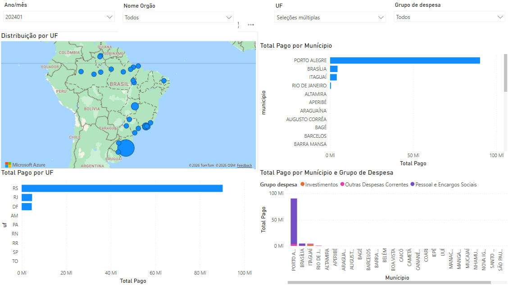

# Transparência Federal Analytics

Plataforma de analytics sobre execução orçamentária do governo federal brasileiro, desenvolvida no **Microsoft Fabric** com arquitetura Medallion (Bronze → Silver → Gold), modelagem Star Schema, processamento em PySpark e T-SQL e integração com Power BI.

**Fonte:** Portal da Transparência — CGU &nbsp;|&nbsp; **Período:** 2024 &nbsp;|&nbsp; **Atualização:** mensal

---
## Índice

- [Visão Geral](#visão-geral)
- [Arquitetura](#arquitetura)
- [Stack](#stack)
- [Modelo de Dados](#modelo-de-dados)
- [Estrutura do Projeto](#estrutura-do-projeto)
- [Notebooks](#notebooks)
- [Como Executar](#como-executar)
- [Decisões de Arquitetura](#decisões-de-arquitetura)
- [O que este projeto demonstra](#o-que-este-projeto-demonstra)

---

## Visão Geral

Este projeto implementa uma plataforma de analytics sobre dados públicos de despesas do governo federal brasileiro, do **Portal da Transparência da CGU** (Controladoria-Geral da União). O objetivo é transformar arquivos brutos de execução orçamentária em uma camada analítica confiável e consultável via SQL, com modelagem dimensional pronta para consumo em BI.

**Perguntas de negócio respondidas:**

- Quais órgãos federais concentram os maiores volumes de despesas empenhadas, liquidadas e pagas?
- Como as despesas públicas se distribuem entre funções, subfunções e programas governamentais?
- Qual a distribuição geográfica da execução orçamentária por UF e localidade?

## Arquitetura


O pipeline é dividido em três camadas:

| Camada | Notebook / Script | O que faz |
|--------|-------------------|-----------|
| Raw → Bronze | `Notebook_raw_to_bronze.ipynb` | Persistência dos arquivos brutos no Lakehouse |
| Bronze → Silver | `Notebook_bronze_to_silver.ipynb` | Padronização de schema, tratamento de tipos e carga incremental com Delta Lake |
| Silver → Gold | `sql/` (T-SQL no SQL Warehouse) | Modelagem dimensional Star Schema — dimensões e fato |

---

## Stack

| Camada              | Tecnologia                          | Papel                                              |
|---------------------|-------------------------------------|----------------------------------------------------|
| Armazenamento       | Microsoft Fabric Lakehouse          | OneLake — Bronze (Files) e Silver (Delta Tables)  |
| Processamento       | PySpark (Fabric Notebooks)          | Transformação Bronze → Silver                      |
| Camada analítica    | Fabric SQL Warehouse (T-SQL)        | Star Schema — dimensões e fato (Gold)              |
| Formato de dados    | Delta Lake                          | ACID, time travel, carga incremental               |
| Modelagem           | Star Schema / Kimball               | Dimensional modeling com surrogate keys            |
| Visualização        | Power BI (Semantic Model)           | Relatório analítico sobre camada Gold              |
| Plataforma          | Microsoft Fabric                    | Ambiente unificado de analytics                    |

**Fonte de dados:** [Portal da Transparência — CGU](https://portaldatransparencia.gov.br/download-de-dados/despesas)  
Arquivos CSV mensais de execução de despesas do governo federal.

---

## Modelo de Dados

O Gold Layer implementa um **Star Schema** no SQL Warehouse do Fabric, seguindo a Metodologia de Kimball. A granularidade da tabela fato é o **empenho individual** — o evento de menor granularidade na execução orçamentária federal.


Star Schema implementado no SQL Warehouse com **5 dimensões** e **tabela fato no grão do empenho individual**.

### Dimensões

**`dim_orgao`** — Estrutura administrativa e orçamentária dos órgãos federais.

| Coluna | Descrição |
|---|---|
| `orgao_sk` | Surrogate key da dimensão (`IDENTITY`) |
| `codigo_orgao_superior` | Código do órgão superior |
| `nome_orgao_superior` | Nome do órgão superior (ex: Ministério da Saúde) |
| `codigo_orgao_subordinado` | Código do órgão subordinado |
| `nome_orgao_subordinado` | Nome do órgão subordinado |
| `codigo_unidade_gestora` | Código da unidade gestora responsável pela execução |
| `nome_unidade_gestora` | Nome da unidade gestora |
| `codigo_gestao` | Código da gestão administrativa |
| `nome_gestao` | Nome da gestão administrativa |
| `codigo_unidade_orcamentaria` | Código da unidade orçamentária |
| `nome_unidade_orcamentaria` | Nome da unidade orçamentária |

---
**`dim_programa`** — Classificação funcional-programática das despesas públicas.

| Coluna | Descrição |
|---|---|
| `programa_sk` | Surrogate key da dimensão (`IDENTITY`) |
| `codigo_programa_governo` | Código do programa de governo |
| `nome_programa_governo` | Nome do programa de governo |
| `codigo_funcao` | Código da função governamental |
| `nome_funcao` | Nome da função governamental (ex: Saúde, Educação) |
| `codigo_subfuncao` | Código da subfunção |
| `nome_subfuncao` | Nome da subfunção |
| `codigo_programa_orcamentario` | Código do programa orçamentário |
| `nome_programa_orcamentario` | Nome do programa orçamentário |
| `codigo_plano_orcamentario` | Código do plano orçamentário |
| `plano_orcamentario` | Nome/descrição do plano orçamentário |
| `codigo_acao` | Código da ação orçamentária |
| `nome_acao` | Nome da ação orçamentária |

---
**`dim_natureza_despesa`** — Classificação econômica e contábil das despesas.

| Coluna | Descrição |
|---|---|
| `natureza_despesa_sk` | Surrogate key da dimensão (`IDENTITY`) |
| `codigo_categoria_economica` | Código da categoria econômica |
| `nome_categoria_economica` | Categoria econômica da despesa (corrente ou capital) |
| `codigo_grupo_de_despesa` | Código do grupo de despesa |
| `nome_grupo_de_despesa` | Nome do grupo de despesa |
| `codigo_elemento_de_despesa` | Código do elemento de despesa |
| `nome_elemento_de_despesa` | Nome do elemento de despesa |
| `codigo_modalidade_da_despesa` | Código da modalidade de aplicação |
| `modalidade_da_despesa` | Nome da modalidade de aplicação |

---
**`dim_localidade`** — Informações geográficas e de localização da execução orçamentária.

| Coluna | Descrição |
|---|---|
| `localidade_sk` | Surrogate key da dimensão (`IDENTITY`) |
| `uf` | Sigla da unidade federativa (ex: SP, RJ, BA) |
| `municipio` | Município relacionado à execução da despesa |
| `codigo_subtitulo` | Código do subtítulo orçamentário |
| `nome_subtitulo` | Nome do subtítulo orçamentário |
| `codigo_localizador` | Código do localizador do gasto |
| `nome_localizador` | Nome do localizador do gasto |
| `sigla_localizador` | Sigla do localizador |
| `descricao_complementar_localizador` | Descrição complementar do localizador |

---

**`dim_tempo`** — Calendário analítico mensal.

| Coluna       | Descrição                             |
|--------------|---------------------------------------|
| `tempo_sk`   | Surrogate key (formato YYYYMM)        |
| `ano_mes`    | Data de referência (YYYY-MM-01)       |
| `ano`        | Ano de competência                    |
| `mes`        | Número do mês (1–12)                  |

### Tabela Fato

**`fct_despesas`** — Tabela fato contendo métricas financeiras da execução orçamentária federal no grão do empenho individual.

| Coluna | Descrição |
|---|---|
| `despesa_sk` | Surrogate key da fato (`IDENTITY`) |
| `orgao_sk` | FK → `dim_orgao` |
| `programa_sk` | FK → `dim_programa` |
| `natureza_despesa_sk` | FK → `dim_natureza_despesa` |
| `localidade_sk` | FK → `dim_localidade` |
| `tempo_sk` | FK → `dim_tempo` |
| `valor_empenhado_reais` | Valor empenhado da despesa |
| `valor_liquidado_reais` | Valor liquidado da despesa |
| `valor_pago_reais` | Valor efetivamente pago |
| `valor_restos_a_pagar_inscritos_reais` | Valor inscrito em Restos a Pagar |
| `valor_restos_a_pagar_cancelado_reais` | Valor cancelado de Restos a Pagar |
| `valor_restos_a_pagar_pagos_reais` | Valor pago de Restos a Pagar |

---

## Estrutura do Projeto

```
transparencia-federal-analytics/
│
├── notebooks/
│   ├── Notebook_raw_to_bronze.ipynb         # Raw → Bronze
│   └── Notebook_bronze_to_silver.ipynb      # Bronze → Silver (PySpark)
│
├── sql/
│   ├── create_dim_localidade.sql
│   ├── create_dim_natureza_despesa.sql
│   ├── create_dim_orgao.sql
│   ├── create_dim_programa.sql
│   ├── create_dim_tempo.sql
│   ├── create_fct_despesas.sql
│   ├── dim_localidade.sql
│   ├── dim_natureza_despesa.sql
│   ├── dim_orgao.sql
│   ├── dim_programa.sql
│   ├── dim_tempo.sql
│   └── fct_despesas.sql
│
└── docs/
    ├── architecture.png
    ├── star_schema.png
    ├── dashboard_overview.png
    └── dashboard_geografico.png
```

---
### `Notebook_raw_to_bronze.ipynb` — Ingestão Raw → Bronze

Responsável pela ingestão dos arquivos CSV brutos do Portal da Transparência para a camada Bronze no Lakehouse (`Files/bronze`), preservando os dados originais sem transformação.

**Principais responsabilidades:**
- leitura dos arquivos governamentais
- organização dos arquivos na camada Bronze
- preservação do dado bruto para rastreabilidade e reprocessamento
- padronização inicial da estrutura de ingestão

---

### `Notebook_bronze_to_silver.ipynb` — PySpark

Responsável pela transformação dos dados da camada Bronze em tabelas Delta limpas, tipadas e prontas para modelagem analítica na camada Silver.

**Transformações aplicadas:**
- padronização de nomes de colunas
- tratamento de valores nulos
- conversão de colunas monetárias
- cast de tipos
- limpeza e normalização dos dados
- carga incremental com `MERGE INTO`


## Como Executar

### Pré-requisitos

- Microsoft Fabric com trial ativo
- Arquivos CSV do Portal da Transparência ([download aqui](https://portaldatransparencia.gov.br/download-de-dados/despesas))

### Passo a passo

**1. Configurar o ambiente no Fabric**

Criar um Workspace e um Lakehouse (`transparencia_lh`) e um SQL Warehouse (`transparencia_wh`).

**2. Carregar os arquivos**

Fazer upload dos CSVs baixados para `Files/raw/` no Lakehouse.

**3. Executar os notebooks em ordem**

```
Notebook_raw_to_bronze.ipynb       # persiste os arquivos em bronze/
Notebook_bronze_to_silver.ipynb    # transforma e carrega a Delta table silver_despesas
```

**4. Criar o schema e carregar o Gold**

No SQL Warehouse, executar os scripts na seguinte ordem:

```sql
-- 1. Criar as tabelas
create_dim_tempo.sql
create_dim_orgao.sql
create_dim_programa.sql
create_dim_natureza_despesa.sql
create_dim_localidade.sql
create_fct_despesas.sql

-- 2. Carregar os dados
dim_tempo.sql
dim_orgao.sql
dim_programa.sql
dim_natureza_despesa.sql
dim_localidade.sql
fct_despesas.sql
```

**5. Criar o Semantic Model e o relatório Power BI**

No Fabric, criar o Semantic Model a partir das tabelas Gold e publicar o relatório.

---

## Dashboards

### Visão Executiva


### Análise Geográfica


---

## Decisões de Arquitetura

**Ingestão manual (Raw → Bronze)**
Os arquivos do Portal da Transparência apresentaram falhas intermitentes no conector HTTP nativo do Data Factory no Fabric. A ingestão foi desacoplada do pipeline analítico — arquivos são baixados manualmente e carregados no Lakehouse. Como os dados são estáticos por mês, isso não compromete o fluxo.

**PySpark no Silver, T-SQL no Gold**
Os arquivos governamentais têm encoding `latin1`, separadores de milhar e decimal no padrão brasileiro e campos textuais mistos — o PySpark lida bem com isso. Para a camada Gold, T-SQL no SQL Warehouse é mais adequado para modelagem dimensional com `IDENTITY` e `MERGE` controlado por chave de negócio.

**Star Schema no SQL Warehouse em vez do Lakehouse**
O SQL Warehouse oferece `IDENTITY(1,1)` para surrogate keys e um otimizador SQL nativo mais adequado para consultas analíticas sobre modelo dimensional. A idempotência da carga é garantida pelo `MERGE`, não por hash de chave.

## O que este projeto demonstra

### Competências de Engenharia de Dados

- **Medallion Architecture** (Bronze / Silver / Gold) com responsabilidades bem definidas por camada
- **Ingestão incremental** com MERGE INTO — idempotência garantida mesmo em recargas
- **Tratamento de dados governamentais** — encoding não-padrão, formatos de moeda brasileiros, campos com valores textuais mistos
- **Modelagem dimensional (Kimball / Star Schema)** — 5 dimensões + 1 tabela fato no grão correto
- **Separação de engines por propósito** — PySpark para transformação, T-SQL para modelagem analítica
---

**Dados públicos:** [Portal da Transparência — CGU](https://portaldatransparencia.gov.br/download-de-dados/despesas)
